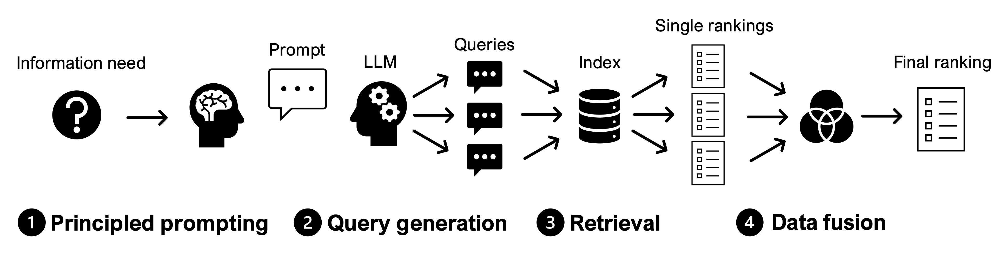

# Data Fusion of Synthetic Query Variants With Generative Large Language Models 



This repository accompanies our SIGIR-AP'24 paper submission entitled *"Data Fusion of Synthetic Query Variants With Generative Large Language Models"*. It contains the code and results to make the experiments transparent and reproducible. All of the experiments can be reproduced with the help of the [Jupyter Notebooks](./src/). Before rerunning the code, the test collections have to be obtained and placed in the correct directories to index them with `ir_datasets`. Please refer to the corresponding links below for more details about the data preparation, and also to directly access the generated query variants.


**Core17:** **[[New York Times Annotated Corpus](https://catalog.ldc.upenn.edu/LDC2008T19)]** **|** **[[qrels](https://trec.nist.gov/data/core/qrels.txt)]** **|** **[[topics](https://trec.nist.gov/data/core/core_nist.txt)]** **|** **[[ir_datasets](https://ir-datasets.com/nyt.html)]**  **|** **[[query variants](./queries/gpt-4o/core17.csv)]**  
**Core18:**  **[[TREC Washington Post Corpus](https://trec.nist.gov/data/wapost/)]** **|** **[[qrels](https://trec.nist.gov/data/core/qrels2018.txt)]** **|** **[[topics](https://trec.nist.gov/data/core/topics2018.txt)]** **|** **[[ir_datasets](https://ir-datasets.com/wapo.html)]** **|** **[[query variants](./queries/gpt-4o/core18.csv)]**  
**Robust04:** **[[TREC disks 4 and 5](https://trec.nist.gov/data/cd45/index.html)]** **|** **[[qrels](https://trec.nist.gov/data/robust/qrels.robust2004.txt)]** **|** **[[topics](https://trec.nist.gov/data/robust/04.testset.gz)]** **|** **[[ir_datasets](https://ir-datasets.com/disks45.html)]**  **|** **[[query variants](./queries/gpt-4o/robust04.csv)]**  
**Robust05:** **[[The AQUAINT Corpus of English News Text](https://catalog.ldc.upenn.edu/LDC2002T31)]** **|** **[[qrels](https://trec.nist.gov/data/robust/05/TREC2005.qrels.txt)]** **|** **[[topics](https://trec.nist.gov/data/robust/05/05.50.topics.txt)]** **|** **[[ir_datasets](https://ir-datasets.com/aquaint.html)]**  **|** **[[query variants](./queries/gpt-4o/robust05.csv)]**

## Abstract

[](http://arxiv.org/abs/2411.03881)

> Considering query variance in Information Retrieval (IR) experiments is beneficial for retrieval effectiveness. Especially ranking ensembles based on different topically related queries retrieve better results than rankings based on a single query alone. Recently, generative instruction-tuned Large Language Models (LLMs) improved on a variety of different tasks in capturing human language. To this end, this work explores the feasibility of using synthetic query variants generated by instruction-tuned LLMs in data fusion experiments. More specifically, we introduce a lightweight, unsupervised, and cost-efficient approach that exploits principled prompting and data fusion techniques. In our experiments, LLMs produce more effective queries when provided with additional context information on the topic. Furthermore, our analysis based on four TREC newswire benchmarks shows that data fusion based on synthetic query variants is significantly better than baselines with single queries and also outperforms pseudo-relevance feedback methods. We publicly share the code and query datasets with the community as resources for follow-up studies. 
  

## Query datasets

The query variants datasets can be found in the [queries/](./queries/) directory. To make the datasets interoperable, they are stored as `csv` files (separated with `;`). Each line follows the following format of `<query number>;<prompt strategy>;<topic number>;<query string>`, e.g., `1;P-1;303;Hubble Telescope discoveries`. The datasets can also be accessed with the links provided above.

## Directory overview

| Directory | Description |
| --- | --- |
| `figures/` | Figures of the paper. |
| `indices/` | Empty directory, indices will be created here. |
| `qrels/` | Qrels files of Core17, Core18, Robust04, and Robust05. |
| `queries/` | Query datasets. |
| `runs/` | Fused rankings and baselines. |
| `src/` | Notebooks for running the experiments (more details below). |
| `topics/` | Topic files of Core17, Core18, Robust04, and Robust05. |

## Notebooks overview

To rerun the query generation, experiments, and evaluations, execute the notebooks in the order as listed in the table below. Before generating the queries, make sure to [store your OpenAI credentials in an environment variable](https://platform.openai.com/docs/quickstart).

| Notebook | Description |
| --- | --- |
| [`query_generation.ipynb`](./src/query_generation.ipynb) | Generate queries with different prompts. |
| [`datasets_indexing.ipynb`](./src/datasets_indexing.ipynb) | Index datasets of Core17, Core18, Robust04, and Robust05 |
| [`retrieval_and_data_fusion.ipynb`](./src/retrieval_and_data_fusion.ipynb) | Retrieve rankings and fuse them. |
| [`evaluations.ipynb`](./src/evaluations.ipynb) | Evaluate fused retrieval effectiveness with different prompts, and with different numbers of queries. |

## Citation

```
@inproceedings{sigirap24/data_fusion,
  author       = {Timo Breuer},
  title        = {Data Fusion of Synthetic Query Variants 
                  With Generative Large Language Models},
  booktitle    = {Proceedings of the 2024 Annual International 
                  ACM SIGIR Conference on Research and 
                  Development in Information Retrieval in the 
                  Asia Pacific Region, December 9--12, 2024, 
                  Tokyo, Japan},
  publisher    = {{ACM}},
  year         = {2024},
  url          = {https://doi.org/10.1145/3673791.3698423},
  doi          = {10.1145/3673791.3698423}
}
```